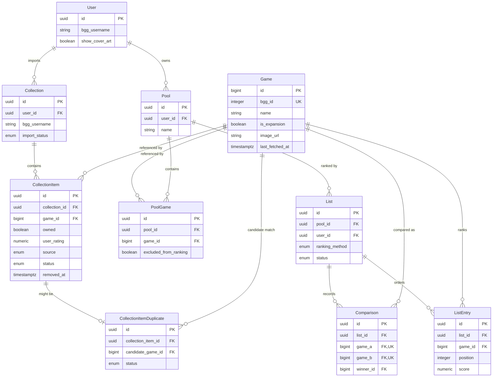
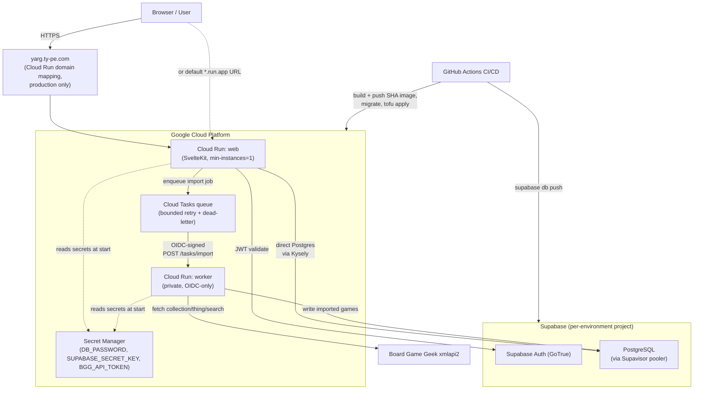
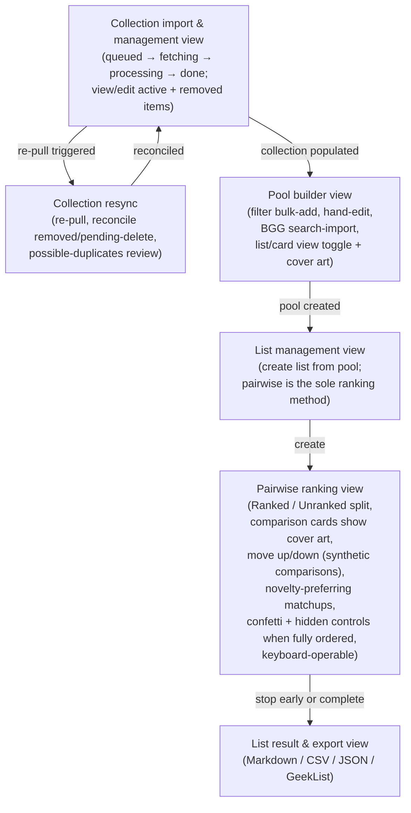

# yet-another-rank-games

[](https://github.com/sponsors/moui72)

Build ranked lists of board games from your [BoardGameGeek](https://boardgamegeek.com)
collection. A single collection feeds many themed, filtered lists ("top 10
co-op", "top 100 of all time"), ranked primarily through a fun **pairwise
comparison** flow (with manual drag-to-order as an override).

Design and decisions live in [`.project/`](./.project) (the ARDD workflow):
`artifacts/` holds the constitution, data model, infrastructure, and UI specs;
`plans/` and `tasks/` drive implementation.

## Tech stack

- **SvelteKit** (Svelte 5 / runes) + **TypeScript** end-to-end, `adapter-node`
- **Supabase** — Postgres + Auth
- **GCP** — Cloud Run (web + import worker), Cloud Tasks (BGG import queue)
- **openskill** — the pairwise ranking (Bradley–Terry/Weng–Lin) model

## Development

```sh
npm install        # also runs husky + svelte-kit sync (prepare)
npm run dev        # dev server
npm run build      # production build (adapter-node)
```

### Quality gates

| Script | What it does |
|---|---|
| `npm run lint` | ESLint (incl. `no-explicit-any`) |
| `npm run check` | `svelte-check` / `tsc` type-check |
| `npm run test` | Vitest unit tests (`src/**/*.test.ts`) |
| `npm run coverage` | Vitest with v8 coverage |
| `npm run coverage:ratchet` | Coverage + never-decrease ratchet |
| `npm run test:e2e` | Playwright + axe (WCAG 2.1 AA) |

A **pre-commit hook** (husky) runs lint → check → unit tests before every
commit. Bypassing it (`--no-verify`) is prohibited except in a documented
emergency, and any bypass must be immediately followed by a commit that
restores the passing state. **CI** (`.github/workflows/ci.yml`) is the gate of
record and additionally runs the e2e/axe suite and the coverage ratchet.

Development is **test-first (TDD)**: write the failing test, then the
implementation. Coverage on `src/lib` logic is enforced as a never-decrease
ratchet (`coverage-baseline.json`); accessibility is held to **WCAG 2.1 AA**.

## Source layout

Entry points only wire dependencies; logic lives in focused modules
(constitution Principles XIII, XV).

```
src/
  lib/
    domain/   Pure, framework-free business logic (ranking, filters, scoring)
    types/    Shared, exported types — the single source of truth for shapes
    server/   Server-only modules (DB, BGG client, auth) — never shipped to the client
  routes/     SvelteKit routes: thin; delegate to lib/
e2e/          Playwright accessibility / end-to-end specs
scripts/      Repo tooling (e.g. the coverage ratchet)
```

## Datamodel



## Infrastructure



## UI



